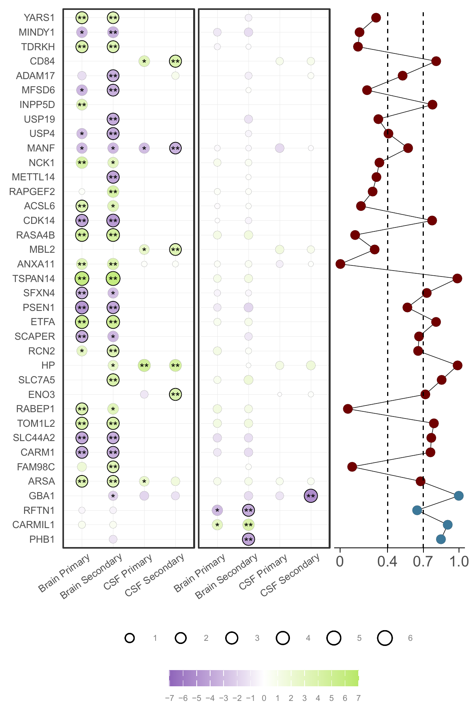

**AD Sex-Biased Genomics & Proteomics**

### 

```bash
# These variables must be set prior to submitting jobs or opening an interactive session. 
export LSF_DOCKER_VOLUMES="/storage1/fs1/belloy/Active:/storage1/fs1/belloy/Active \
/storage2/fs1/belloy2/Active:/storage2/fs1/belloy2/Active /scratch1/fs1/belloy:/scratch1/fs1/belloy $HOME:$HOME"
export CONDA_ENVS_DIRS="/storage1/fs1/belloy/Active/conda/envs/"
export CONDA_PKGS_DIRS="/storage1/fs1/belloy/Active/conda/pkgs/"
export PATH="/opt/conda/bin:$PATH"
export LSF_DOCKER_ENTRYPOINT=/bin/bash
```

## Tables
### EUR AD PWAS sex-specific hits and correspnding AD PWAS results across the EU_all analyses by sex
Sex-specific AD PWAS results for the sex-specific genes identified in the principal European sex-specific AD PWAS including the UKB cohort and corresponding findings from the European sensitivity AD PWAS. Findings were considered consistent in sensitivity analyses if the discovery sex maintained P<0.05 and the opposite sex maintained P>0.05. The most significant findings across primary and secondary discoveries are reported when applicable.

```bash
Rscript PWAS/analysis_codes/Fgiures_Tables/TableS18.R \
        --dir PWAS/Figures_Tables/ \
        --female_top_gene ADGC_ADSP_UKB_FinnGen_Females_cc_rb.gen090.noAPOE.shared_var.W23nCSF.hg38_PWAS_noMHC_ext2Mb_top-female-specific-genes.txt \
        --male_top_gene ADGC_ADSP_UKB_FinnGen_Males_cc_rb.gen090.noAPOE.shared_var.W23nCSF.hg38_PWAS_noMHC_ext2Mb_top-male-specific-genes.txt \
        --noUKB_brain_dir PWAS/EU_noUKB/Brain/Sex/ \
        --noUKB_CSF_dir PWAS/EU_noUKB/CSF/Sex/ \
        --noUKB_female_primary_brain_PWASfile ADGC_ADSP_FinnGen_Females_cc.gen090.noAPOE.shared_var.hg19_eurLD_PWAS_noMHC_ext2Mb_non-strat_sex-strat_W23_weights.txt \
        --noUKB_male_primary_brain_PWASfile ADGC_ADSP_FinnGen_Males_cc.gen090.noAPOE.shared_var.hg19_eurLD_PWAS_noMHC_ext2Mb_non-strat_sex-strat_W23_weights.txt \
        --noUKB_female_primary_CSF_PWASfile ADGC_ADSP_FinnGen_Females_cc.gen090.noAPOE.shared_var.hg38_PWAS_wHP_noMHC_ext2Mb_non-strat_sex-strat_CSFcis_weights.txt \
        --noUKB_male_primary_CSF_PWASfile ADGC_ADSP_FinnGen_Males_cc.gen090.noAPOE.shared_var.hg38_PWAS_wHP_noMHC_ext2Mb_non-strat_sex-strat_CSFcis_weights.txt \
        --Known_locus_file PWAS/SupportingFiles/AD_Risk_Loci_consensus_2024.txt
```


### EUR AD PWAS sex-specific hits, and corresponding AFR PWAS of AD findings and cross-ancestry consistency results
Sex-specific AD PWAS results for the sex-specific genes identified in the principal European sex-specific AD PWAS, and corresponding findings in the sex-stratified AFR AD PWAS and the combined sample-size weighted results. Observations of sex heterogeneity concistency are indicated. EUR findings were considered consistent in African ancestry analyses if the P-value in the discovery sex improved after meta-analyzing the EUR and AFR findings, while the opposite sex maintained P>0.05. The most significant findings across the primary and secondary discoveries are reported when applicable.
```bash
Rscript PWAS/analysis_codes/Fgiures_Tables/TableS23.R \
        --dir PWAS/Figures_Tables/ \
        --female_top_gene ADGC_ADSP_UKB_FinnGen_Females_cc_rb.gen090.noAPOE.shared_var.W23nCSF.hg38_PWAS_noMHC_ext2Mb_top-female-specific-genes.txt \
        --male_top_gene ADGC_ADSP_UKB_FinnGen_Males_cc_rb.gen090.noAPOE.shared_var.W23nCSF.hg38_PWAS_noMHC_ext2Mb_top-male-specific-genes.txt \
        --PD_dir PWAS/EU_all/ \
        --fb_combZ ADGC_ADSP_UKB_FinnGen_Females_cc_rb.gen090.noAPOE.shared_var.hg19_eurLD_PWAS_W23_fsg_sex-het_comb-AFRad_full-Z.txt \
        --mb_combZ ADGC_ADSP_UKB_FinnGen_Males_cc_rb.gen090.noAPOE.shared_var.hg19_eurLD_PWAS_W23_msg_sex-het_comb-AFRad_full-Z.txt \
        --fc_combZ ADGC_ADSP_UKB_FinnGen_Females_cc_rb.gen090.noAPOE.shared_var.hg38_PWAS_NGI-CSFc_fsg_sex-het_comb-AFRad_full-Z.txt \
        --mc_combZ ADGC_ADSP_UKB_FinnGen_Males_cc_rb.gen090.noAPOE.shared_var.hg38_PWAS_NGI-CSFc_msg_sex-het_comb-AFRad_full-Z.txt
```

## Figures

```bash

```bash
Rscript PWAS/analysis_codes?Fogures_Tables/DotPlot_Figure2C.R \
        --dir PWAS/Figures_Tables/ \
        --dat ADGC_ADSP_UKB_FinnGen_cc_rb.gen090.noAPOE.shared_var.W23nCSF.hg38_top-sex-specific-genes_dotplot_matrix.txt \
        --f_ss_genes ADGC_ADSP_UKB_FinnGen_Females_cc_rb.gen090.noAPOE.shared_var.W23nCSF.hg38_PWAS_noMHC_ext2Mb_top-female-specific-genes_ExDMR.txt \
        --m_ss_genes ADGC_ADSP_UKB_FinnGen_Males_cc_rb.gen090.noAPOE.shared_var.W23nCSF.hg38_PWAS_noMHC_ext2Mb_top-male-specific-genes_ExDMR.txt
```


  

### Circos plot
```bash
Rscript PWAS/analysis_codes?Fogures_Tables/CircosPlot_Figure2B.R \
        --dir PWAS/Figures_Tables/ \
        --f_ss_genes ADGC_ADSP_UKB_FinnGen_Females_cc_rb.gen090.noAPOE.shared_var.W23nCSF.hg38_PWAS_noMHC_ext2Mb_top-female-specific-genes_ExDMR.txt \
        --m_ss_genes ADGC_ADSP_UKB_FinnGen_Males_cc_rb.gen090.noAPOE.shared_var.W23nCSF.hg38_PWAS_noMHC_ext2Mb_top-male-specific-genes_ExDMR.txt
```
<table>
  <tr>
    <td></td>
  </tr>
  <tr>
    <td align="center"><b>Figurr:</b> Combined</td>
  </tr>
</table>

**Citation:** If you use these scripts, please cite our PWAS paper (in preparation).  
**License:** MIT (see [main repository README](../README.md) for full text).
