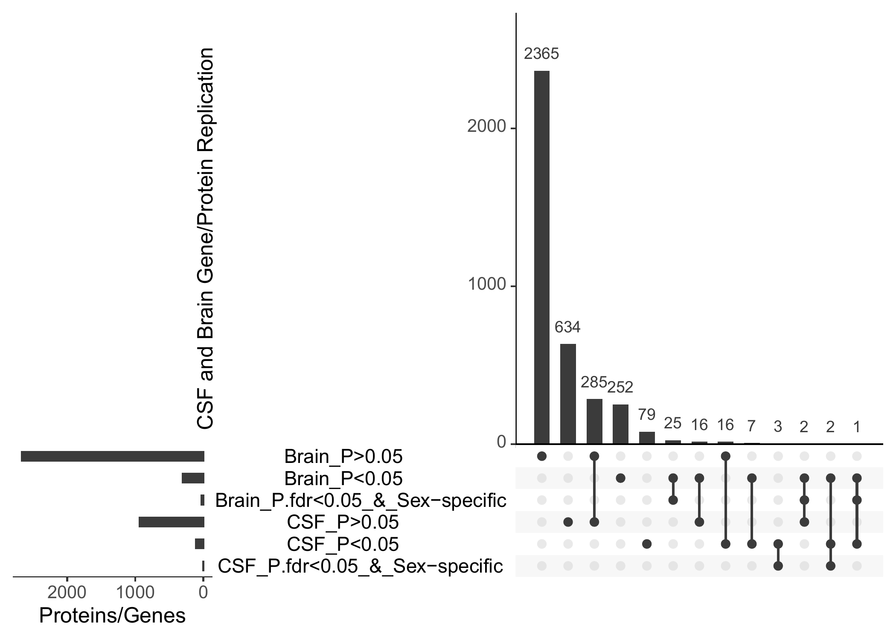
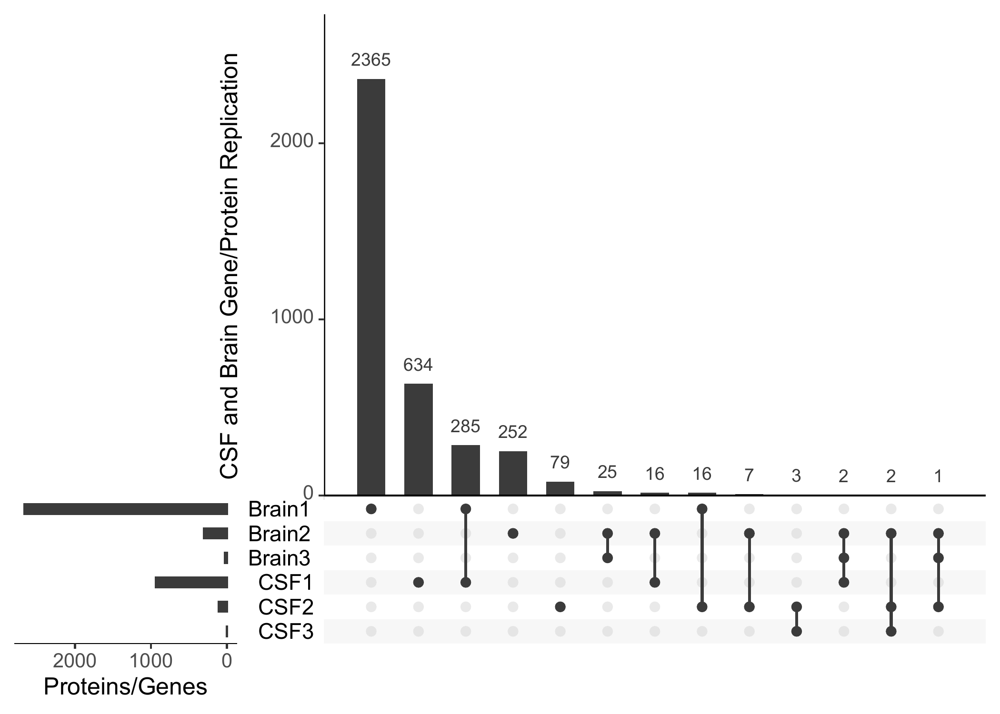
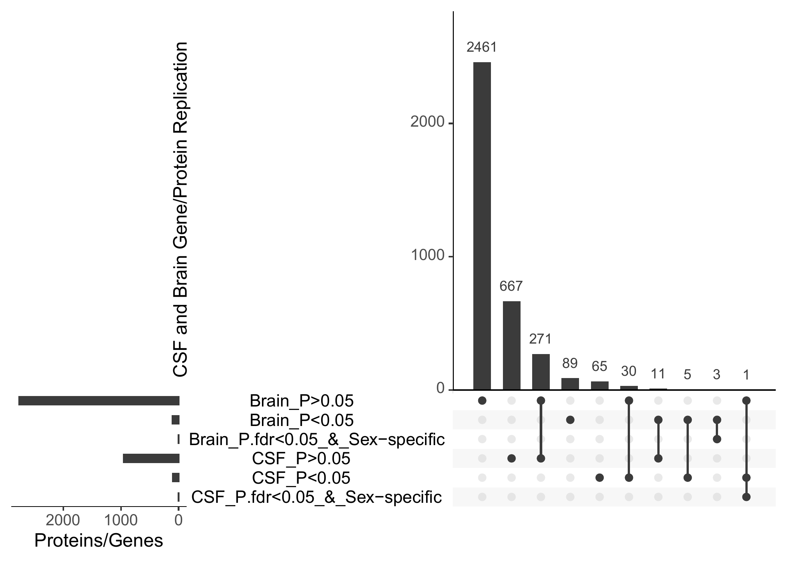
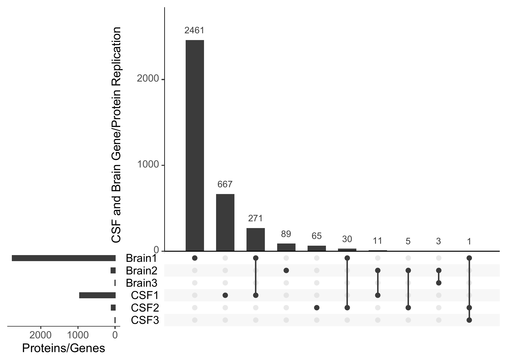
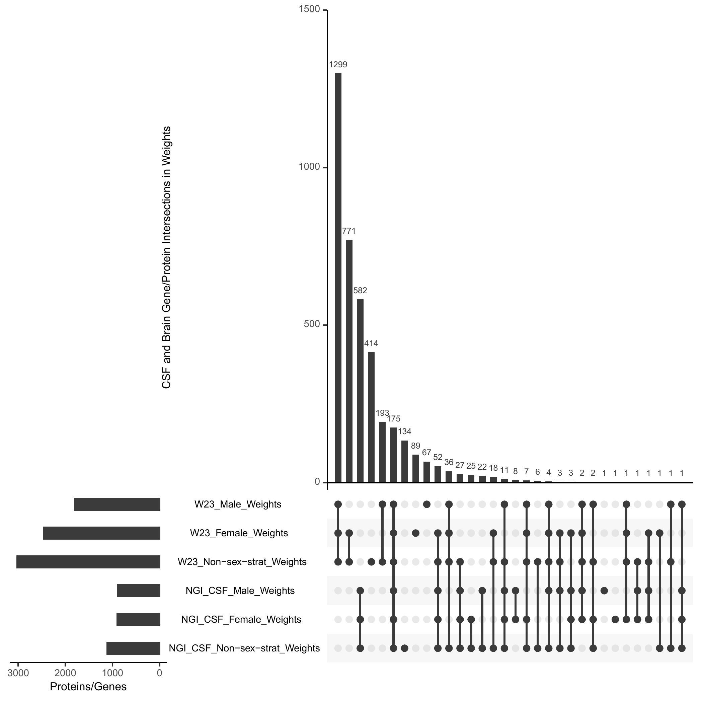
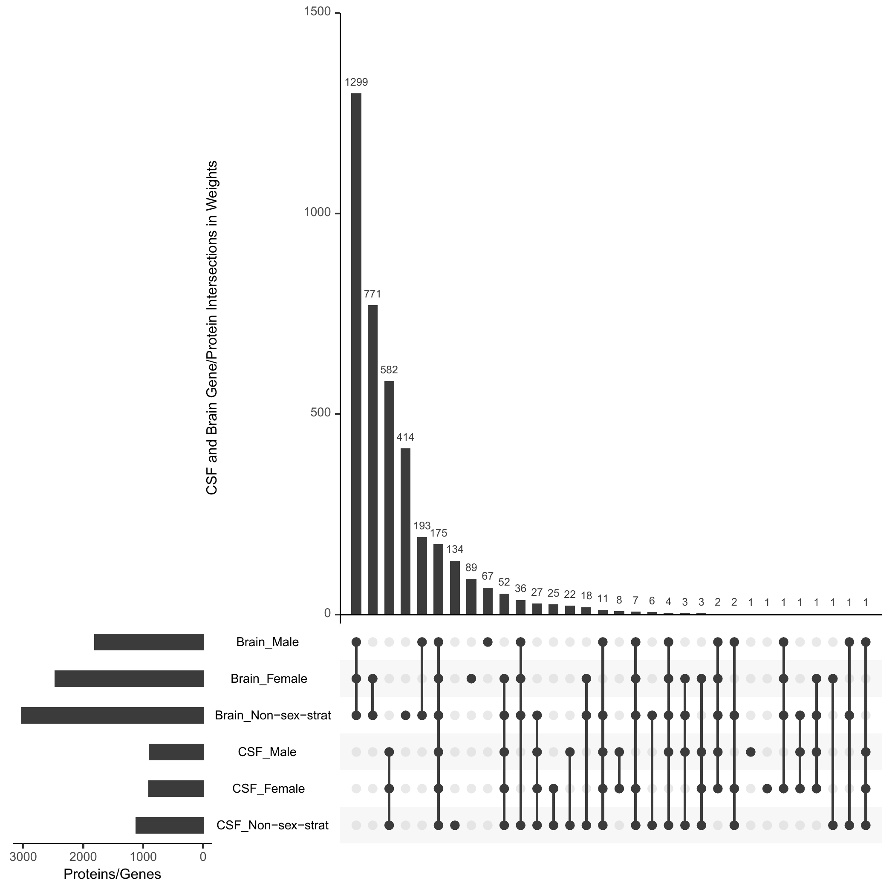
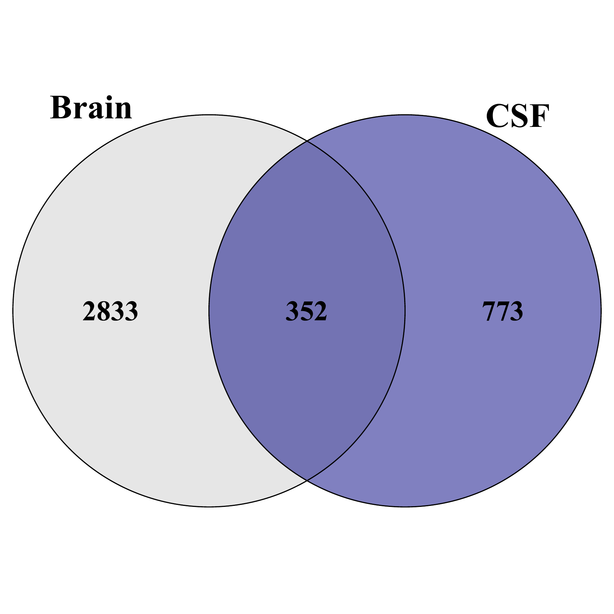
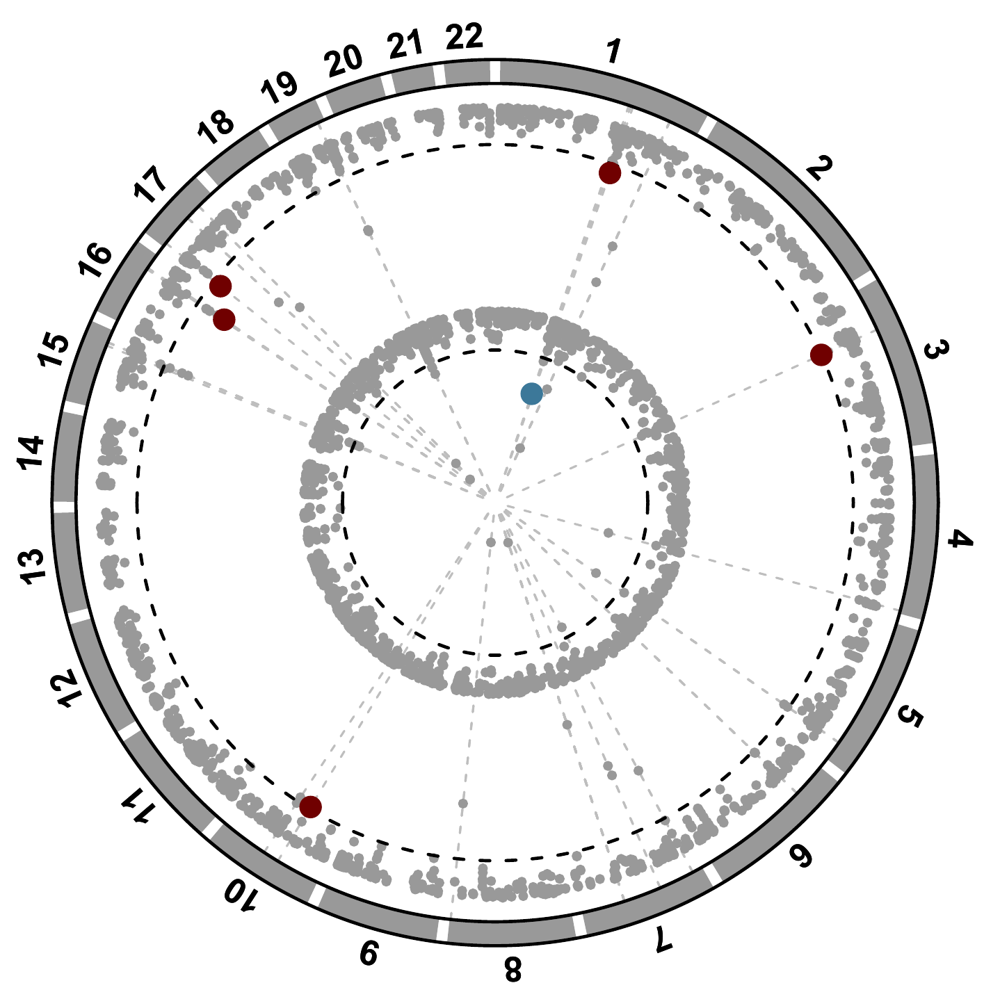
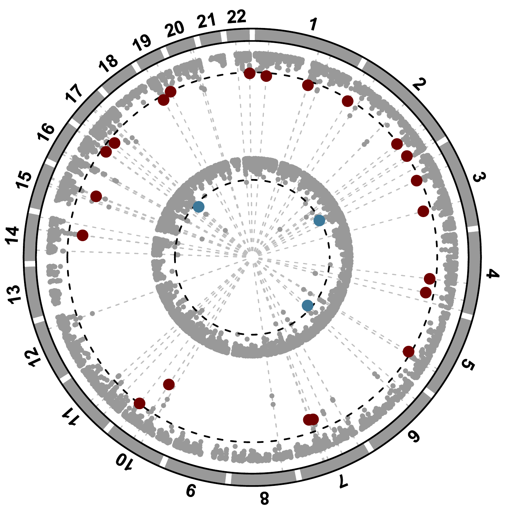

**Sex Strat AD PWAS**

## Figures

### 

```bash
# These variables must be set prior to submitting jobs or opening an interactive session. 
export LSF_DOCKER_VOLUMES="/storage1/fs1/belloy/Active:/storage1/fs1/belloy/Active \
/storage2/fs1/belloy2/Active:/storage2/fs1/belloy2/Active /scratch1/fs1/belloy:/scratch1/fs1/belloy $HOME:$HOME"
export CONDA_ENVS_DIRS="/storage1/fs1/belloy/Active/conda/envs/"
export CONDA_PKGS_DIRS="/storage1/fs1/belloy/Active/conda/pkgs/"
export PATH="/opt/conda/bin:$PATH"
export LSF_DOCKER_ENTRYPOINT=/bin/bash
```

### Upset plot

```bash
bsub -g /satheshkumar/compute-belloy -J Upsetplot -n 1 -N \
-o /storage2/fs1/belloy2/Active/05_Projects/$USER/PWAS/Figures_Tables/outs/Upsetplot.%J.out \
-e /storage2/fs1/belloy2/Active/05_Projects/sivas/dreidRep/Figures_Tables/outs/Upsetplot.%J.err \
-q subscription -R 'rusage[mem=32GB] span[hosts=1]' -G compute-belloy-t1 -sla compute-belloy-t1 -a 'docker(dmr07083/fusion-project:4.3.2)' \
Rscript /storage2/fs1/belloy2/Active/04_Code/$USER/PWAS/Figures_Tables/UpsetPlot.R \
        --out_dir /storage2/fs1/belloy2/Active/05_Projects/$USER/PWAS/Figures_Tables/ \
        --fb_pf /storage2/fs1/belloy2/Active/05_Projects/$USER/PWAS/Brain/Sex/Females_results/ADGC_ADSP_UKB_FinnGen_Females_cc_rb.gen090.noAPOE.shared_var.hg19_eurLD_PWAS_noMHC_ext2Mb_non-strat_sex-strat_W23_weights.txt \
        --fb_if /storage2/fs1/belloy2/Active/05_Projects/$USER/PWAS/Brain/Sex/Females_results/ADGC_ADSP_UKB_FinnGen_Females_cc_rb.gen090.noAPOE.shared_var.hg19_eurLD_PWAS_noMHC_ext2Mb_non-strat_sex-strat_W23_top-female-specific-genes_novelty.txt \
        --fc_pf /storage2/fs1/belloy2/Active/05_Projects/$USER/PWAS/CSF/Sex/Females_results/ADGC_ADSP_UKB_FinnGen_Females_cc_rb.gen090.noAPOE.shared_var.hg38_PWAS_wHP_noMHC_ext2Mb_non-strat_sex-strat_CSFcis_weights.txt \
        --fc_if /storage2/fs1/belloy2/Active/05_Projects/$USER/PWAS/CSF/Sex/Females_results/ADGC_ADSP_UKB_FinnGen_Females_cc_rb.gen090.noAPOE.shared_var.hg38_PWAS_wHP_noMHC_ext2Mb_non-strat_sex-strat_CSFcis_top-female-specific-genes_novelty.txt \
        --mb_pf /storage2/fs1/belloy2/Active/05_Projects/$USER/PWAS/Brain/Sex/Males_results/ADGC_ADSP_UKB_FinnGen_Males_cc_rb.gen090.noAPOE.shared_var.hg19_eurLD_PWAS_noMHC_ext2Mb_non-strat_sex-strat_W23_weights.txt \
        --mb_if /storage2/fs1/belloy2/Active/05_Projects/$USER/PWAS/Brain/Sex/Males_results/ADGC_ADSP_UKB_FinnGen_Males_cc_rb.gen090.noAPOE.shared_var.hg19_eurLD_PWAS_noMHC_ext2Mb_non-strat_sex-strat_W23_top-male-specific-genes_novelty.txt \
        --mc_pf /storage2/fs1/belloy2/Active/05_Projects/$USER/PWAS/CSF/Sex/Males_results/ADGC_ADSP_UKB_FinnGen_Males_cc_rb.gen090.noAPOE.shared_var.hg38_PWAS_wHP_noMHC_ext2Mb_non-strat_sex-strat_CSFcis_weights.txt \
        --mc_if /storage2/fs1/belloy2/Active/05_Projects/$USER/PWAS/CSF/Sex/Males_results/ADGC_ADSP_UKB_FinnGen_Males_cc_rb.gen090.noAPOE.shared_var.hg38_PWAS_wHP_noMHC_ext2Mb_non-strat_sex-strat_CSFcis_top-male-specific-genes_novelty.txt \
        --fb /storage2/fs1/belloy2/Active/05_Projects/$USER/PWAS/Brain/Sex/Females_results/ADGC_ADSP_UKB_FinnGen_Females_cc_rb.gen090.noAPOE.shared_var.hg19_eurLD_PWAS_noMHC_ext2Mb_sex-strat-W23_weights.txt \
        --fnb /storage2/fs1/belloy2/Active/05_Projects/$USER/PWAS/Brain/NonSex/Females_results/ADGC_ADSP_UKB_FinnGen_Females_cc_rb.gen090.noAPOE.shared_var.hg19_eurLD_PWAS_noMHC_ext2Mb_non-sex-strat-W23_weights.txt \
        --mb /storage2/fs1/belloy2/Active/05_Projects/$USER/PWAS/Brain/Sex/Males_results/ADGC_ADSP_UKB_FinnGen_Males_cc_rb.gen090.noAPOE.shared_var.hg19_eurLD_PWAS_noMHC_ext2Mb_sex-strat-W23_weights.txt \
        --mnb /storage2/fs1/belloy2/Active/05_Projects/$USER/PWAS/Brain/NonSex/Males_results/ADGC_ADSP_UKB_FinnGen_Males_cc_rb.gen090.noAPOE.shared_var.hg19_eurLD_PWAS_noMHC_ext2Mb_non-sex-strat-W23_weights.txt \
        --fc /storage2/fs1/belloy2/Active/05_Projects/$USER/PWAS/CSF/Sex/Females_results/ADGC_ADSP_UKB_FinnGen_Females_cc_rb.gen090.noAPOE.shared_var.hg38_PWAS_wHP_noMHC_ext2Mb_sex-strat-CSFcis_weights.txt \
        --fnc /storage2/fs1/belloy2/Active/05_Projects/$USER/PWAS/CSF/NonSex/Females_results/ADGC_ADSP_UKB_FinnGen_Females_cc_rb.gen090.noAPOE.shared_var.hg38_PWAS_wHP_noMHC_ext2Mb_non-sex-strat-CSFcis_weights.txt \
        --mc /storage2/fs1/belloy2/Active/05_Projects/$USER/PWAS/CSF/Sex/Males_results/ADGC_ADSP_UKB_FinnGen_Males_cc_rb.gen090.noAPOE.shared_var.hg38_PWAS_wHP_noMHC_ext2Mb_sex-strat-CSFcis_weights.txt \
        --mnc /storage2/fs1/belloy2/Active/05_Projects/$USER/PWAS/CSF/NonSex/Males_results/ADGC_ADSP_UKB_FinnGen_Males_cc_rb.gen090.noAPOE.shared_var.hg38_PWAS_wHP_noMHC_non-sex-strat-CSF_weights-raw.txt \
        --mfb /storage2/fs1/belloy2/Active/05_Projects/$USER/PWAS/Brain/Sex/MaleGWAS_FemaleProtWGT_results/ADGC_ADSP_UKB_FinnGen_Males_cc_rb.gen090.noAPOE.shared_var.hg19_eurLD_PWAS_noMHC_ext2Mb_sex-strat-W23_female-weights.txt \
        --mfc /storage2/fs1/belloy2/Active/05_Projects/$USER/PWAS/CSF/Sex/MaleGWAS_FemaleProtWGT_results/ADGC_ADSP_UKB_FinnGen_Males_cc_rb.gen090.noAPOE.shared_var.hg38_PWAS_wHP_noMHC_ext2Mb_sex-strat-CSFcis_female-weights.txt \
        --fmb /storage2/fs1/belloy2/Active/05_Projects/$USER/PWAS/Brain/Sex/FemaleGWAS_MaleProtWGT_results/ADGC_ADSP_UKB_FinnGen_Females_cc_rb.gen090.noAPOE.shared_var.hg19_eurLD_PWAS_noMHC_ext2Mb_sex-strat-W23_male-weights.txt \
        --fmc /storage2/fs1/belloy2/Active/05_Projects/$USER/PWAS/CSF/Sex/FemaleGWAS_MaleProtWGT_results/ADGC_ADSP_UKB_FinnGen_Females_cc_rb.gen090.noAPOE.shared_var.hg38_PWAS_wHP_noMHC_ext2Mb_sex-strat-CSFcis_male-weights.txt

```
  

<table>
  <tr>
    <td></td>
    <td></td>
  </tr>
  <tr>
    <td align="center"><b>Figure 1:</b> </td>
    <td align="center"><b>Figure 2:</b> </td>
   </tr>
</table>
  

<table>
  <tr>
    <td></td>
    <td></td>
  </tr>
  <tr>
    <td align="center"><b>Figure 1:</b> </td>
    <td align="center"><b>Figure 2:</b> </td>
   </tr>
</table>


### Venn diagram
#### Note: install ggVennDiagram R package into 4.3.2 docker
```bash
bsub -g /$USER/compute-belloy -J Venny -n 1 -N \
-o /storage2/fs1/belloy2/Active/05_Projects/$USER/PWAS/Figures_Tables/logs/VennDiagram.%J.out \
-e /storage2/fs1/belloy2/Active/05_Projects/$USER/PWAS/Figures_Tables/logs/VennDiagram.%J.err \
-q subscription -R 'rusage[mem=32GB] span[hosts=1]' -G compute-belloy-t1 -sla compute-belloy-t1 -a 'docker(dmr07083/fusion-project:4.3.2)' \
Rscript /storage2/fs1/belloy2/Active/04_Code/$USER/PWAS/Figures_Tables/VennDiagram_FigureS14.R \
        --dir /storage2/fs1/belloy2/Active/05_Projects/$USER/PWAS/Figures_Tables/ \
        --QCfile Overlap_W23-norm_NGI-CSF-QC.txt \
        --weightfile Overlap_cis_NGI-CSF_W23_weights.txt
```
<table>
  <tr>
    <td></td>
    <td></td>
  </tr>
  <tr>
    <td align="center"><b>Figure 1:</b> </td>
    <td align="center"><b>Figure 2:</b> </td>
   </tr>
</table>
  

<table>
  <tr>
    <td></td>
    <td></td>
  </tr>
  <tr>
    <td align="center"><b>Figure 1:</b> QC</td>
    <td align="center"><b>Figure 2:</b> Significant proteins</td>
   </tr>
</table>
  
  
### Dot plot
<!--```bash
bsub -g /$USER/compute-belloy -J Venny -n 2 -N \
-o /storage2/fs1/belloy2/Active/05_Projects/$USER/PWAS/Figures_Tables/logs/DotPlot_V1.%J.out \
-e /storage2/fs1/belloy2/Active/05_Projects/$USER/PWAS/Figures_Tables/logs/DotPlot_V1.%J.err \
-q subscription -R 'rusage[mem=32GB] span[hosts=1]' -G compute-belloy-t1 -sla compute-belloy-t1 -a 'docker(dmr07083/fusion-project:4.3.2)' \
Rscript /storage2/fs1/belloy2/Active/04_Code/$USER/PWAS/Figures_Tables/DotPlot_Figure2C_V1.R \
        --dir /storage2/fs1/belloy2/Active/05_Projects/$USER/PWAS/Figures_Tables/ \
        --dat ADGC_ADSP_UKB_FinnGen_cc_rb.gen090.noAPOE.shared_var.W23nCSF.hg38_top-sex-specific-genes_dotplot_matrix.txt \
        --f_ss_genes ADGC_ADSP_UKB_FinnGen_Females_cc_rb.gen090.noAPOE.shared_var.W23nCSF.hg38_PWAS_noMHC_ext2Mb_top-female-specific-genes_ExDMR.txt \
        --m_ss_genes ADGC_ADSP_UKB_FinnGen_Males_cc_rb.gen090.noAPOE.shared_var.W23nCSF.hg38_PWAS_noMHC_ext2Mb_top-male-specific-genes_ExDMR.txt
```
echo "This won't appear"
-->

```bash
bsub -g /$USER/compute-belloy -J DotPlot -n 1 -N \
-o /storage2/fs1/belloy2/Active/05_Projects/$USER/PWAS/Figures_Tables/logs/DotPlot_V2.%J.out \
-e /storage2/fs1/belloy2/Active/05_Projects/$USER/PWAS/Figures_Tables/logs/DotPlot_V2.%J.err \
-q subscription -R 'rusage[mem=32GB] span[hosts=1]' -G compute-belloy-t1 -sla compute-belloy-t1 -a 'docker(dmr07083/fusion-project:4.3.2)' \
Rscript /storage2/fs1/belloy2/Active/04_Code/$USER/PWAS/Figures_Tables/DotPlot_Figure2C_V2.R \
        --dir /storage2/fs1/belloy2/Active/05_Projects/$USER/PWAS/Figures_Tables/ \
        --dat ADGC_ADSP_UKB_FinnGen_cc_rb.gen090.noAPOE.shared_var.W23nCSF.hg38_top-sex-specific-genes_dotplot_matrix.txt \
        --f_ss_genes ADGC_ADSP_UKB_FinnGen_Females_cc_rb.gen090.noAPOE.shared_var.W23nCSF.hg38_PWAS_noMHC_ext2Mb_top-female-specific-genes_ExDMR.txt \
        --m_ss_genes ADGC_ADSP_UKB_FinnGen_Males_cc_rb.gen090.noAPOE.shared_var.W23nCSF.hg38_PWAS_noMHC_ext2Mb_top-male-specific-genes_ExDMR.txt
```


  

### Circos plot
```bash
bsub -g /$USER/compute-belloy -J Circos -n 2 -N \
-o /storage2/fs1/belloy2/Active/05_Projects/$USER/PWAS/Figures_Tables/logs/Circos.%J.out \
-e /storage2/fs1/belloy2/Active/05_Projects/$USER/PWAS/Figures_Tables/logs/Circos.%J.err \
-q subscription -R 'rusage[mem=32GB] span[hosts=1]' -G compute-belloy-t1 -sla compute-belloy-t1 -a 'docker(dmr07083/fusion-project:4.3.2)' \
Rscript /storage2/fs1/belloy2/Active/04_Code/$USER/PWAS/Figures_Tables/CircosPlot_Figure2B.R \
        --dir /storage2/fs1/belloy2/Active/05_Projects/$USER/PWAS/Figures_Tables/ \
        --f_ss_genes ADGC_ADSP_UKB_FinnGen_Females_cc_rb.gen090.noAPOE.shared_var.W23nCSF.hg38_PWAS_noMHC_ext2Mb_top-female-specific-genes_ExDMR.txt \
        --m_ss_genes ADGC_ADSP_UKB_FinnGen_Males_cc_rb.gen090.noAPOE.shared_var.W23nCSF.hg38_PWAS_noMHC_ext2Mb_top-male-specific-genes_ExDMR.txt
```
<table>
  <tr>
    <td></td>
    <td></td>
    <td></td>
  </tr>
  <tr>
    <td align="center"><b>Figure 1:</b> CSF PWAS</td>
    <td align="center"><b>Figure 2:</b> Brain PWAS</td>
    <td align="center"><b>Figure 3:</b> Combined</td>
  </tr>
</table>

__END__