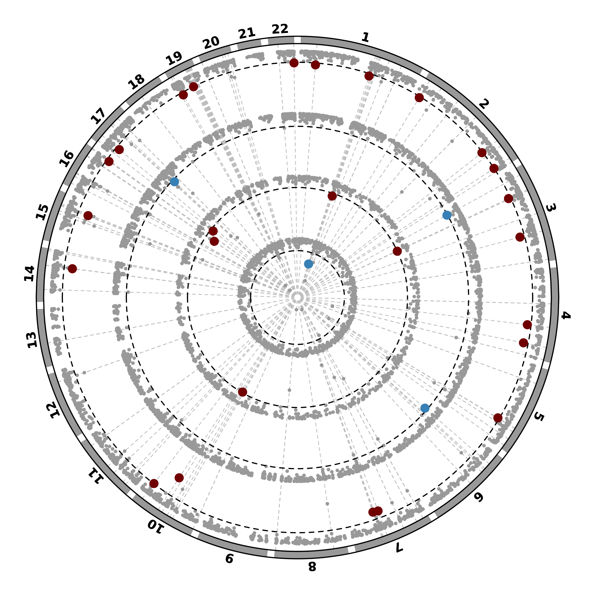

**AD Sex-Biased Genomics & Proteomics**

## Tables

### Sex specificty analysis
To identify sex-specific genes from the PWAS results, run the wrapper script below.
This wrapper (Sex_specificy_wrapper.bash) will execute the underlying Sex_specific_genes.R script to generate merged PWAS results and sex-specific gene lists for each category.

```bash
bash analysis_codes/Sex_specificy_wrapper.bash
```

### Table S18 and 2
To generate Table S18 and Table 2, run the following R script:

```bash
bash analysis_codes/Tables_S18and2.R
```

## Figures
### Manhattan plots
Generate Manhattan plots for the PWAS results using:

```bash
Rscript analysis_codes/Manhattan_Plots.R \
  --path /storage2/fs1/belloy2/Active/05_Projects/sivas/PWAS/EU_all
```
Use the --remove_chr option to exclude specified chromosomes from the plot.

### Scatter plot
Generate scatter plots for the PWAS results using:

```bash
Rscript analysis_codes/Scatter_Plots.R \
  --path /storage2/fs1/belloy2/Active/05_Projects/sivas/PWAS/EU_all
```
Similarly, the --remove_chr option allows removal of specific chromosomes from the plot.

### Circos plot
Generate circos plots highlighting sex-specific genes using:
```bash
Rscript analysis_codes/Circos_Plot.R \
  --path /storage2/fs1/belloy2/Active/05_Projects/sivas/PWAS/EU_all \
  --remove_genes CEBPZOS,PACSIN1,MINDY1,USP19,ANXA11,SCAPER,RCN2,RABEP1,CARM1
```
Here, the --remove_genes and/or --remove_chr options can be used to exclude specific genes and/or chromosomes from the visualization.

<table>
  <tr>
    <td></td>
  </tr>
  <tr>
    <td align="center"><b>Figure:</b> Circos plot</td>
  </tr>
</table>

---
**Citation:** see [main repository README](../README.md) 
**License:** see [main repository README](../README.md)
