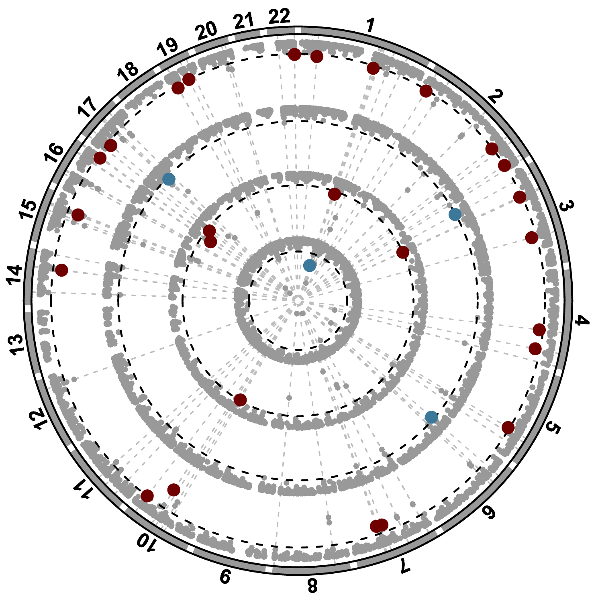

**AD Sex-Biased Genomics & Proteomics**

## Tables

### Sex specificty analysis
To find teh sex specific gene list from PWAS results please run Sex_specificy_wrapper.bash script. This wrapper will run the Sex_specific_genes.R script to generate merged PWAS results and sex specific gene list in each categories.  

```bash
bash analysis_codes/Sex_specificy_wrapper.bash
```

### Table S18 and 2

```bash
bash analysis_codes/Tables_S18and2.R
```

## Figures
### Manhattan plots

```bash
Rscript analysis_codes/Manhattan_Plots.R \
  --path /storage2/fs1/belloy2/Active/05_Projects/sivas/PWAS/EU_all
```
--remove_chr option in the script will remove the metioed chrosomes from teh plot 

### Scatter plot

```bash
Rscript analysis_codes/Scatter_Plots.R \
  --path /storage2/fs1/belloy2/Active/05_Projects/sivas/PWAS/EU_all
```
--remove_chr option in the script will remove the metioed chrosomes from teh plot 

### Circos plot
```bash
Rscript analysis_codes/CircosPlot_Figure2B.R \
        --dir PWAS/Figures_Tables/ \
        --f_ss_genes ADGC_ADSP_UKB_FinnGen_Females_cc_rb.gen090.noAPOE.shared_var.W23nCSF.hg38_PWAS_noMHC_ext2Mb_top-female-specific-genes_ExDMR.txt \
        --m_ss_genes ADGC_ADSP_UKB_FinnGen_Males_cc_rb.gen090.noAPOE.shared_var.W23nCSF.hg38_PWAS_noMHC_ext2Mb_top-male-specific-genes_ExDMR.txt
```
<table>
  <tr>
    <td></td>
  </tr>
  <tr>
    <td align="center"><b>Figurr:</b> Combined</td>
  </tr>
</table>

---
**Citation:** see [main repository README](../README.md) 
**License:** see [main repository README](../README.md)
