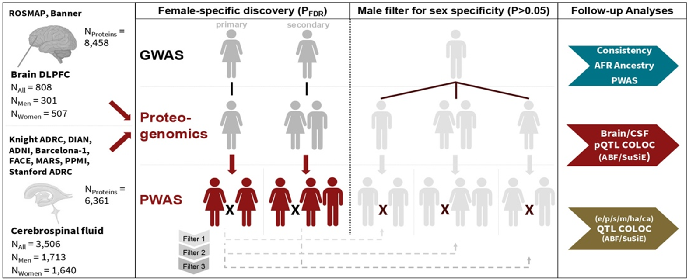

**Sex Strat AD PWAS**

## Methods
Sex-stratified and sex-heterogeneity AD GWAS were conducted in European ancestry individuals using a 3-stage design, followed by fixed-effects meta-analysis. PWAS were conducted via FUSION, combining sex-stratified AD GWAS with sex-matched and non-sex-stratified protein-specific variant weights, respectively. Significant findings in European ancestry were evaluated for sex heterogeneity consistency with admixed African ancestry AD GWAS (improved sex heterogeneity P-value upon fixed-effects meta-analysis) and PWAS (sample-size weighted Z-score combination improved in matching sex and non-significant Z-score (P>0.05) in opposite sex).

**Figure 1. Sex-stratified AD proteome-wide association studies in brain and CSF.** PWAS study design illustration for identification of female-specific AD risk genes. The primary discovery represents a fully sex-matched PWAS. The secondary discovery used non-stratified pQTL data to leverage its additional power and assess the relevance of sex-matching in gene discovery. Significant findings were subsequently filtered for nominally significant outcomes in male analyses to prioritize female-specific AD associated genes.

## License (MIT)

Copyright (c) 2025 Sathesh K. Sivasankaran

Permission is hereby granted, free of charge, to any person obtaining a copy
of this software and associated documentation files (the "Software"), to deal
in the Software without restriction, including without limitation the rights
to use, copy, modify, merge, publish, distribute, sublicense, and/or sell
copies of the Software, and to permit persons to whom the Software is
furnished to do so, subject to the following conditions:

The above copyright notice and this permission notice shall be included in
all copies or substantial portions of the Software.

THE SOFTWARE IS PROVIDED "AS IS", WITHOUT WARRANTY OF ANY KIND, EXPRESS OR
IMPLIED, INCLUDING BUT NOT LIMITED TO THE WARRANTIES OF MERCHANTABILITY,
FITNESS FOR A PARTICULAR PURPOSE AND NONINFRINGEMENT. IN NO EVENT SHALL THE
AUTHORS OR COPYRIGHT HOLDERS BE LIABLE FOR ANY CLAIM, DAMAGES OR OTHER
LIABILITY, WHETHER IN AN ACTION OF CONTRACT, TORT OR OTHERWISE, ARISING FROM,
OUT OF OR IN CONNECTION WITH THE SOFTWARE OR THE USE OR OTHER DEALINGS IN
THE SOFTWARE.