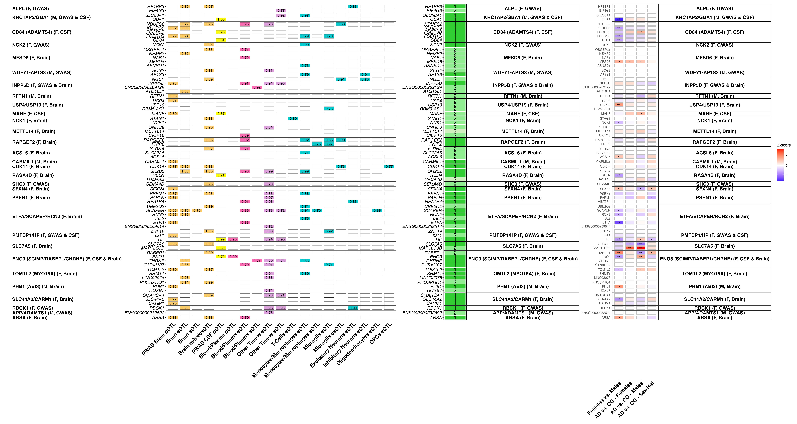

**AD Sex-Biased Genomics & Proteomics**

## xQTL Colocalization Figures

```bash
Rscript analysis_codes/figures/01_xQTL_incGWASPWAS_figures_preprocessing.R \
    --work_dir working/directory/contains/xQTL/results \
    --abf_dir ABF \
    --adj_abf_dir Adj_ABF \
    --susie_dir SUSIE \
    --out_GP_qtl PWAS_GWAS_qtl_results_annotated.csv \
    --out_pwas PWAS_qtl_results_annotated.csv \
    --out_gwas GWAS_qtl_results_annotated.csv \
    --out_mqtl ref_PWAS_GWAS_top_mQTL_results.csv \
    --out_haqtl ref_PWAS_GWAS_top_haQTL_results.csv \
    --out_caqtl ref_PWAS_GWAS_top_caQTL_results.csv\
```
Note: --abf_dir and --susie_dir are directories relative to --work_dir. Place your input CSVs there or adjust the names to match your layout.

### xQTL COLOC and DEG summary figures
This plot (Figure 3 in the paper) includes results summarized findings from the xQTL COLOC analyses and protein differential abudance analyses for genes prioritized through PWAS or pQTL COLOC.

```bash
Rscript analysis_codes/figures/02_xQTL_incGWASPWAS_figures.R \
    --work_dir working/directory/contains/xQTL/results \
    --out_GP_qtl annotated_HP_WDFY1.csv \
    --mqtl_in ref_PWAS_GWAS_top_mQTL_results.csv \
    --haqtl_in ref_PWAS_GWAS_top_haQTL_results.csv \
    --caqtl_in ref_PWAS_GWAS_top_caQTL_results.csv \
    --gnames_in updated_gene_names.csv \
    --index_in GWAS_PWAS_index_genes_novel_final.csv \
    --plot_out Fig3.png
```



### PWAS & pQTL SMR/COLOC summary figure
This plot (Figure 2C in the paper) includes results from PWAS, SMR and Brain & CSF pQTL coloc analyses.

```bash
Rscript analysis_codes/figures/DotPlot.R \
        --dir results/ \
        --dat Top-sex-specific-genes_dotplot_matrix.txt \
        --f_ss_genes Top-female-specific-genes.txt \
        --m_ss_genes Top-male-specific-genes.txt
```


---
**Citation:** see [main repository README](../README.md) 
**License:** see [main repository README](../README.md)
