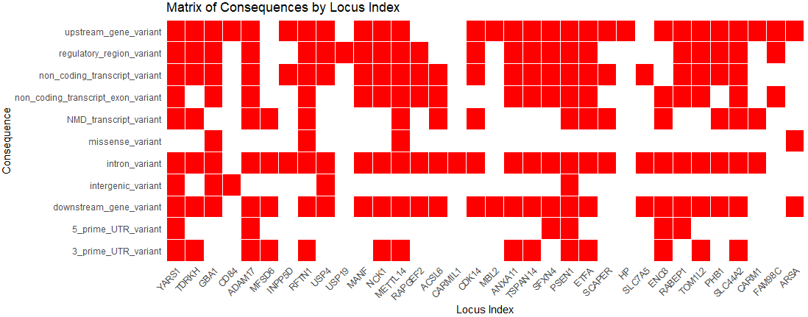

**AD Sex-Biased Genomics & Proteomics**

## VEP Analysis
Both GWAS and PWAS variants are given in the Variants_list folder in both VCF and CSV format forthe VEP analysis.

- Upload the VCF files directly to the Ensembl VEP web (https://useast.ensembl.org/Tools/VEP) tool.
- Use default parameters, with the following modifications:
    - Species: Homo sapiens
    - Under "Additional configurations":
        - Navigate to "Additional annotations" and enable LOEUF.
        - Under "Predictions", enable CADD and REVEL.
- Submit the job and export the annotated results in .txt format in the "variants_list" folder.

Both resulting .txt files from the VEP analysis (GWAS and PWAS) will be processed using the R script provided below.

## Post-processing
```bash
Rscript analysis_codes/VEP_figures.R \
	--VEP_Dir variants_list/ \
	--Results_dir Results/ \
    --GWAS_VEP  GWAS_VEP_output.txt \
    --GWAS_Var gwas_final_variants.csv \
    --PWAS_VEP PWAS_VEP_output.txt \
    --PWAS_var pwas_final_variants.csv
```




---
**Citation:** see [main repository README](../README.md) 
**License:** see [main repository README](../README.md)
