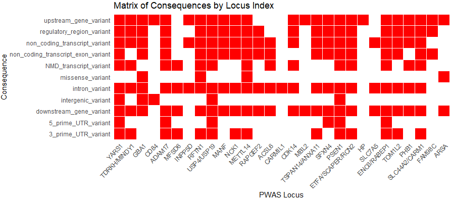

**Sex Strat AD PWAS**

*** Variant Effect Predictor***
### Environment Setup (Required Before Running Any Script)

Before launching jobs or interactive sessions, set the following environment variables:

```bash
export LSF_DOCKER_VOLUMES="/storage1/fs1/belloy/Active:/storage1/fs1/belloy/Active \
/storage2/fs1/belloy2/Active:/storage2/fs1/belloy2/Active /scratch1/fs1/belloy:/scratch1/fs1/belloy $HOME:$HOME"

export CONDA_ENVS_DIRS="/storage1/fs1/belloy/Active/conda/envs/"
export CONDA_PKGS_DIRS="/storage1/fs1/belloy/Active/conda/pkgs/"
export PATH="/opt/conda/bin:$PATH"
export LSF_DOCKER_ENTRYPOINT=/bin/bash
```

### Launch interactive session:
```bash
bsub -Is -G compute-belloy-t1 -q subscription -R 'rusage[mem=40GB]' -a 'docker(dmr07083/fusion-project:4.3.2)' /bin/bash
```

## Project Directory Structure for Analysis
### Set Working Directory
Navigate to your project directory (choose the appropriate path based on your system). Please replace '$USER' with your actual username or preferred folder name. Also, make sure to replace '$USER' with your actual username or preferred folder name in all R and Bash scripts located in the analysis_codes directory.

```bash
cd /storage2/fs1/belloy2/Active/05_Projects/$USER/
mkdir -p VEP/logs
mkdir -p VEP/Results
mkdir -p VEP/Variants_list
```

### Set Up Code Directory
Navigate to 04_Code directory from storage1 or storage2 and set up project-specific code folders:
```bash
cd /storage2/fs1/belloy2/Active/04_Code/$USER/
mkdir VEP
```

Please download the analysis_codes folder from this repository and copy its entire contents into the ..04_Code/$USER/VEP/ directory on the server.
If any folder paths differ from the default setup, make sure to update them accordingly in all R and Bash scripts.

---

### Step 1 - Preprocessing 
Variants must be preprocessed into standard VCF format before being submitted to the Ensembl VEP web tool: https://useast.ensembl.org/Tools/VEP[https://useast.ensembl.org/Tools/VEP]. This preprocessing is performed using the R script provided below.
```bash
Rscript /storage2/fs1/belloy2/Active/04_Code/$USER/VEP/VEP_preprocessing.R \
    --VEP_Dir /storage1/fs1/belloy/Active/04_Code/$USER/VEP \
    --GWAS_dir GWAS \
    --GWAS_file ADGC_ADSP_UKB_FinnGen_sex_het_case_control_reduced_bias.gwama.clean.gen050.exclude_APOE_region.top_vars.csv \
    --GWAS_LD_dir GWAS/LD \
    --PWAS_dir PWAS \
    --PWAS_F_Brain ld_table_female_brain.csv \
    --PWAS_M_Brain ld_table_male_brain.csv \
    --PWAS_F_CSF ld_table_female_csf.csv \
    --PWAS_M_CSF ld_table_male_csf.csv \
    --PWAS_X3504_FC ld_table_csf_X3504.csv \
    --PWAS_TOM1L2_FB ld_table_TOM1L2.csv 
```

### Step 2 - VEP Analysis
- Upload the VCF files directly to the Ensembl VEP web (https://useast.ensembl.org/Tools/VEP) tool.
- Use default parameters, with the following modifications:
    - Species: Homo sapiens
    - Under "Additional configurations":
        - Navigate to "Additional annotations" and enable LOEUF.
        - Under "Predictions", enable CADD and REVEL.
- Submit the job and export the annotated results in .txt format in the "variants_list" folder.

Both resulting .txt files from the VEP analysis (GWAS and PWAS) will be processed using the R script provided below.

### Step 3 - Post-processing
```bash
Rscript /storage2/fs1/belloy2/Active/04_Code/$USER/VEP/VEP_postprocessing.R \
	--VEP_Dir /storage2/fs1/belloy2/Active/04_Code/$USER/VEP/variants_list/ \
	--Results_dir /storage2/fs1/belloy2/Active/04_Code/$USER/VEP/Results/ \
    --GWAS_VEP  GWAS_VEP_output.txt \
    --GWAS_Var gwas_final_variants.csv \
    --PWAS_VEP PWAS_VEP_output.txt \
    --PWAS_var pwas_final_variants.csv
```


Matrix shows VEP-annotated variant consequences for top GWAS and PWAS loci. Columns represent loci (gene names), and rows show functional consequence types. Red blocks indicate at least one SNP at that locus with the corresponding annotation. The plot highlights the range of functional impacts, including both coding and non-coding variants.



---
**Citation:** If you use these scripts, please cite our PWAS paper (in preparation).  
**License:** MIT (see [main repository README](../README.md) for full text).