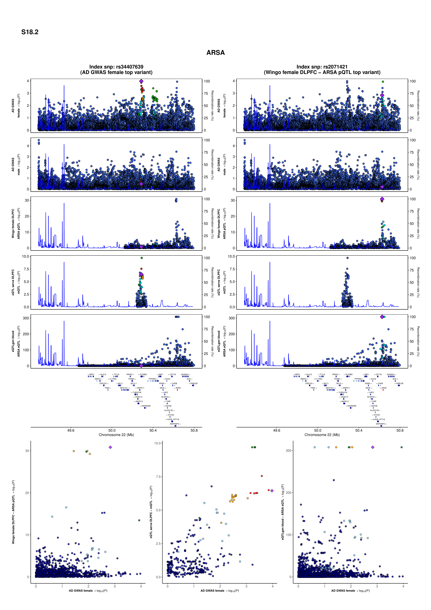

**AD Sex-Biased Genomics & Proteomics**

## Locus zoom plot
We generate locus zoom plots to visualize the genetic architecture around prioritized genes, (eg., ARSA in Figure S18). These plots integrate AD GWAS signals with QTL datasets (pQTL, eQTL, mQTL) and local LD structure, enabling us to examine how association signals overlap across molecular traits and disease. This approach highlights potential causal variants and cell-type–specific mechanisms within defined genomic regions.

### Environment Setup (Required Before Running Any Script)

Before launching jobs or interactive sessions, set the following environment variables:

```bash
export LSF_DOCKER_VOLUMES="/storage1/fs1/belloy/Active:/storage1/fs1/belloy/Active \
/storage2/fs1/belloy2/Active:/storage2/fs1/belloy2/Active /scratch1/fs1/belloy:/scratch1/fs1/belloy $HOME:$HOME"

export CONDA_ENVS_DIRS="/storage1/fs1/belloy/Active/conda/envs/"
export CONDA_PKGS_DIRS="/storage1/fs1/belloy/Active/conda/pkgs/"
export PATH="/opt/conda/bin:$PATH"
export LSF_DOCKER_ENTRYPOINT=/bin/bash
```

### Launch interactive session:
Run the interactive section of fusion project docker if it is needed.

```bash
bsub -Is -G compute-belloy-t1 -q subscription -R 'rusage[mem=100GB]' -a 'docker(dmr07083/fusion-project:4.3.2)' /bin/bash
```

### Set Working Directory
Navigate to your project directory (choose the appropriate path based on your system). Please replace '$USER' with your actual username or preferred folder name. Also, make sure to replace '$USER' with your actual username or preferred folder name in all R and Bash scripts located in the analysis_codes directory.

```bash
cd /storage1/fs1/belloy/Active/05_Projects/$USER/
mkdir -p LocusZoom/figures
mkdir -p Cell_enrichment/logs

# OR
cd /storage2/fs1/belloy2/Active/05_Projects/$USER/
mkdir -p LocusZoom/figures
mkdir -p Cell_enrichment/logs
```

### Set Up Code Directory
Navigate to 04_Code directory from storage1 or storage2 and set up project-specific code folders:
```bash
cd /storage1/fs1/belloy/Active/04_Code/$USER/
mkdir -p Cell_enrichment
# OR
cd /storage2/fs1/belloy2/Active/04_Code/$USER/
mkdir -p Cell_enrichment
```

## Figure S18
This script is customized to produce locus-zoom plots for an example gene, e.g., ARSA in Figure S18.

locus_zoom_s18_ARSA.R (main driver)
function_locus_zoom_s18.R (helpers for windowing, merging, LD, and plotting)

### Key file paths & tools
fold_w – scratch/output temp folder for intermediate files (PLINK outputs).
file_snp – filename suffix for the SNP keep-list written by the pipeline.
pl – PLINK executable (e.g., "plink1.9").
in_fold + in_file – path/prefix to reference genotype PLINK files used for LD (e.g., TOPMed_ch{CHR}).
gtf – GENCODE GTF (imported via rtracklayer) used to map gene symbol → Ensembl gene ID.
User-set locus parameters (where this code is customized to ARSA)

Lines 71–73: chr, bp_1, rsid_1 → chromosome, base-pair position, and index SNP for the AD-GWAS top signal to center the first panel/window.
Lines 101–102: rsid_2, bp_2 → index SNP and position for the pQTL top signal to center the second panel/window.
Update these five values to re-target the figure to another gene/locus.

### Data inputs for the locus zoom plot

### Female AD GWAS summary statistics
```R
female_90 <- fread(".../reduced_bias.gwama.clean.gen090.exclude_APOE_region.shared_var")
```
Expected columns (used downstream): CHR, BP, ALLELE1, ALLELE0, P.
These are windowed to ±1 Mb around bp_1 and mutated to IDs CHR:BP:ALLELE1:ALLELE0 (and the reverse) to merge with QTLs.

### Male AD GWAS summary statistics
```R
male_90 <- fread(".../reduced_bias.gwama.clean.gen090.exclude_APOE_region.shared_var")
```
Same schema/usage as female.

#### Wingo DLPFC pQTL (female)
```R
wingo_female_pQTL <- fread(".../wingo/pQTL/female_DLPFC/female_DLPFC_pQTL.txt")
```

Filtered to ARSA by Ensembl gene ID (gene_id).
Expected columns used after filtering/processing: CHR, BP, A1, A2, P (directly or via renaming in helper steps).

#### Blood eQTL
```R
eQTLgen_blood_eQTL <- fread(".../eQTLgen/eQTL/blood/blood_eQTL.csv")
```
Filtered by gene_id (Ensembl) for the gene of interest; used in the same ±1 Mb window.
Expected columns after filtering/renaming: CHR, BP, A1, A2, P.

#### DLPFC mQTL
```R
xQTL_serve_DLPFC_mQTL <- fread(".../xQTLServe/mQTLs/xQTLServe_mQTL_appended_lifted_to38.csv")
```
Filtered by CpG (probe ID) relevant to the gene region; then renamed to match the expected schema: A1 = ALLELE1, A2 = ALLELE0, pvalue = p → later used as P.
Expected columns after renaming: CHR, BP, A1, A2, P.


All QTL tables are harmonized to a common variant identifier using allele-ordered IDs (CHR:BP:A1:A2) and merged to the AD GWAS variants present in both female and male datasets. The script writes a keep-list of shared SNPs to fold_w for PLINK to compute LD on the same set of variants.


#### LD computation inputs (inside function_locus_zoom_s18.R)
Within calculate_ld(...), the helper:
* Writes a SNP keep-list (fwrite) to paste0(fold_w, rsid, file_snp).
* Runs PLINK on in_fold/in_file{chr} to build a mini-bfile of those SNPs.
* Reads intermediate files with fread:
    * bim <- fread(paste0(fold_w, rsid, ".data.bim")) → to extract variant IDs (V2).
    * LD <- fread(paste0(fold_w, rsid, ".ld")) → LD matrix (converted to as.matrix).
* These are temporary artifacts (cleaned up at the end of the function).

What you must change to run on another gene
* Lines 71–73: set chr, bp_1, and rsid_1 for the target locus’s top AD-GWAS SNP.
* Lines 101–102: set rsid_2 and bp_2 for the top QTL SNP at the same locus (optional second focal SNP).
* Update any gene filters:
    * gene_id (Ensembl) or gene_name → used to subset Wingo pQTL and eQTLGen; the script uses the GTF to derive the correct gene_id for ARSA.
    * For mQTL, change the CpG probe ID(s) relevant to the gene/region.
* Point the five fread paths to your local copies of the datasets (and ensure the expected column names or apply the same renaming).

```bash
bsub -J s18_ARSA -G compute-belloy-t1 -q general -n 1 -M 90000 -R "rusage[mem=90000]" \
  -o /storage2/fs1/belloy2/Active/05_Projects/sivas/LocusZoom/logs/s18_ARSA.%J.out \
  -e /storage2/fs1/belloy2/Active/05_Projects/sivas/LocusZoom/logs/s18_ARSA.%J.err \
  -a 'docker(dmr07083/fusion-project:4.3.2)' \
  Rscript /storage2/fs1/belloy2/Active/04_Codes/sivas/LocusZoom/locus_zoom_s18_ARSA.R
```



### Overlay plot
```bash
bsub -J OL_PSEN1 -G compute-belloy-t1 -q general -n 1 -M 100000 -R "rusage[mem=100000]" \
  -o /storage2/fs1/belloy2/Active/05_Projects/sivas/LocusZoom/logs/s18_ARSA.%J.out \
  -e /storage2/fs1/belloy2/Active/05_Projects/sivas/LocusZoom/logs/s18_ARSA.%J.err \
  -a 'docker(dmr07083/fusion-project:4.3.2)' \
  Rscript /storage2/fs1/belloy2/Active/04_Codes/sivas/LocusZoom/overlay_plot_PSEN1.r
```


---
**Citation:** see [main repository README](../README.md) 
**License:** see [main repository README](../README.md)