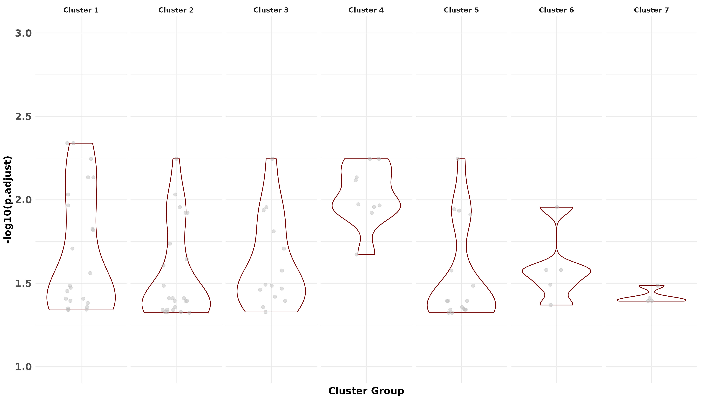
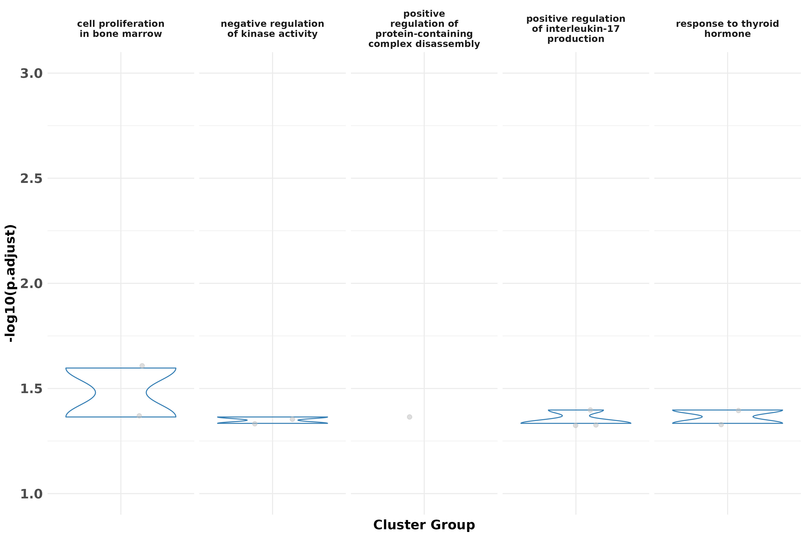
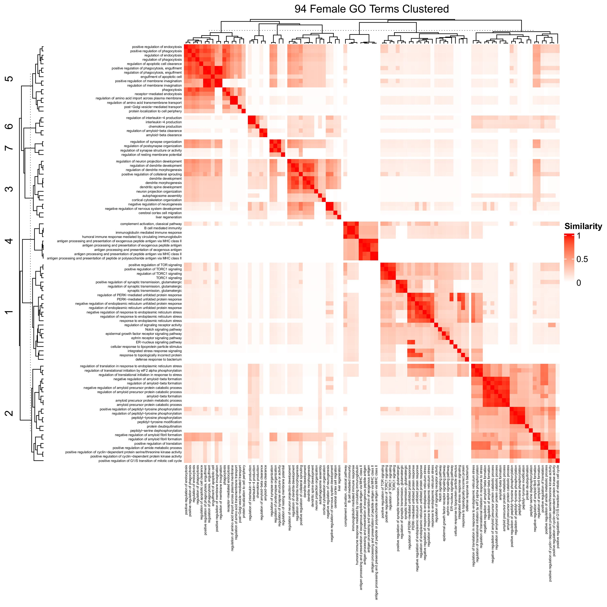
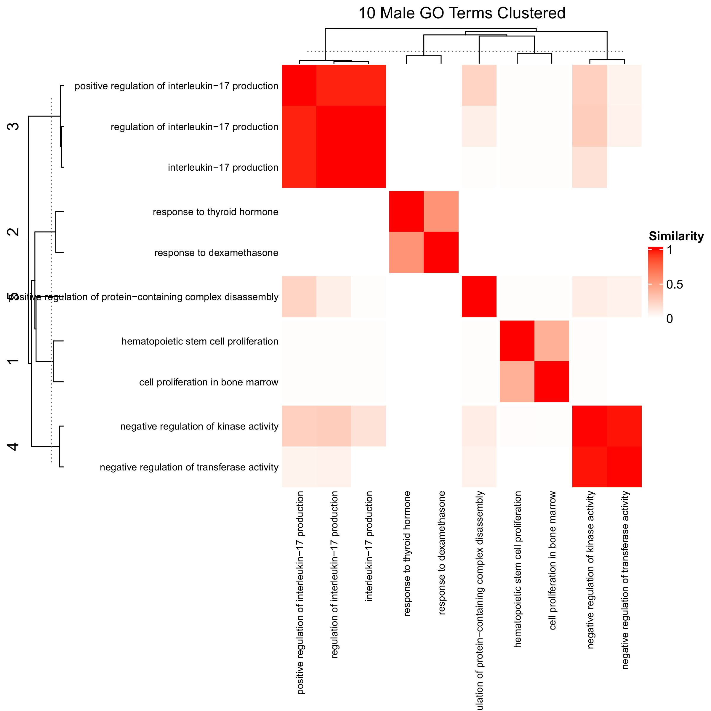

**AD Sex-Biased Genomics & Proteomics**

## Pathway Enrichment

Prioritized genes in men and women were respectively used to perform and visualize gene ontology (GO) enrichment analyses.

# split here into readme.me and analysis.md

**AD Sex-Biased Genomics & Proteomics**

## Pathway Enrichment Analyses

## 1. Run GO enrichment
Run the main enrichment script to perform GO term enrichment for both female and male gene sets followed by filtering GO terms for sex bias. 

```bash
Rscript analysis_codes/Pathway_enrichment.R \
  --work_dir working/directory/to/save/results \
  --gene_list GWAS_PWAS_final_enrichment_list.csv \
  --female_out Female_GO_output.csv \
  --male_out Male_GO_output.csv \
  --female_filtered Female_GO_filtered.csv \
  --male_filtered Male_GO_filtered.csv
```

## 2. Clustering of Enriched GO Terms
Generate clusters based on semantic similarity of GO terms and output visualizations.

```bash
Rscript analysis_codes/Pathway_clustering.R \
  --work_dir working/directory/to/save/results \
  --female_filtered Female_GO_filtered.csv \
  --male_filtered Male_GO_filtered.csv \
  --female_out_csv Female_clusters_final.csv \
  --male_out_csv Male_clusters_final.csv \
  --female_dendro_pdf female_dendrogram.pdf \
  --male_dendro_pdf male_dendrogram.pdf \
  --female_heatmap_pdf female_heatmap.pdf \
  --male_heatmap_pdf male_heatmap.pdf
```

## 3. Visualization of Clustered Results
Generate violin/box plots and word clouds for each enriched cluster.

```bash
Rscript analysis_codes/Pathway_cluster_visualization.R \
--work_dir working/directory/to/save/results \
--female_input Female_clusters_final.csv \
--male_input Male_clusters_final.csv
```

## Plots and heatmaps












---
**Citation:** see [main repository README](../README.md) 
**License:** see [main repository README](../README.md)
