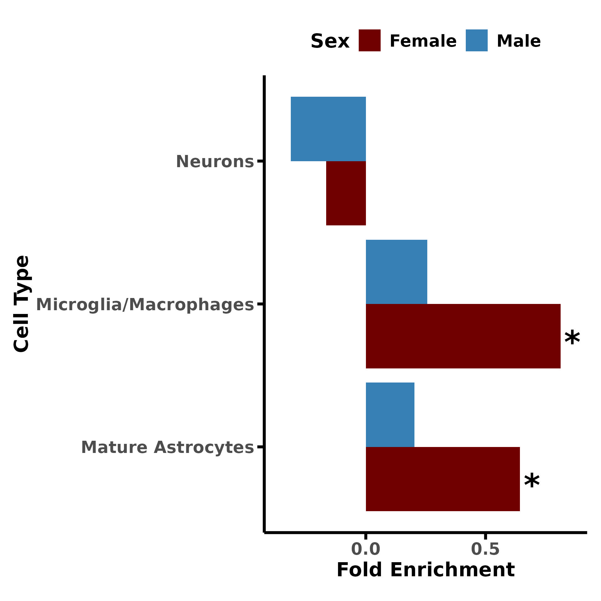

# split here into readme.me and analysis.md

**AD Sex-Biased Genomics & Proteomics**

## Cell-Type Enrichment Analyses

### Step 1 — Cell-specific enrichment
```bash
Rscript analysis_codes/1_cell_specific_analysis.R \
    --work_dir working/directory \
    --gene_list GWAS_PWAS_final_enrichment_list.csv \
    --background_list background_genes.csv \
    --results_out cell_specific_enrichment_results_All.csv
```

### Step 2 — Cell-specific figures
```bash
Rscript analysis_codes/2_cell_specific_figures.R \
    --work_dir working/directory \
    --results_in cell_specific_enrichment_results_All.csv \
    --out_fig cell-type_enrichment_barplot_Filtered.jpg
```



---
**Citation:** see [main repository README](../README.md) 
**License:** see [main repository README](../README.md)
